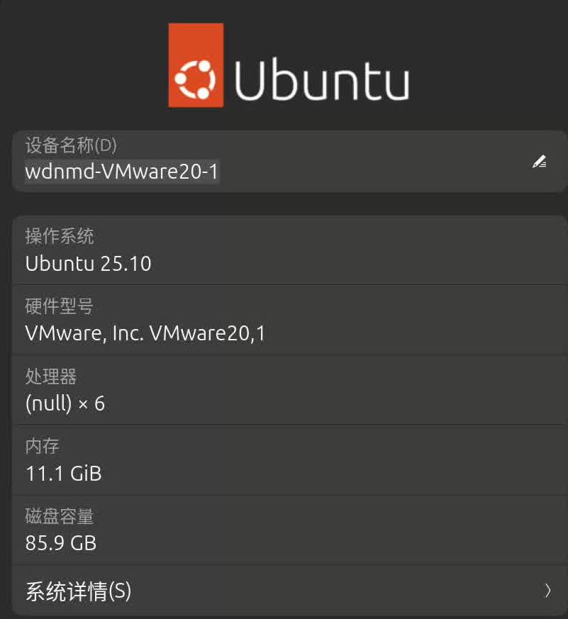
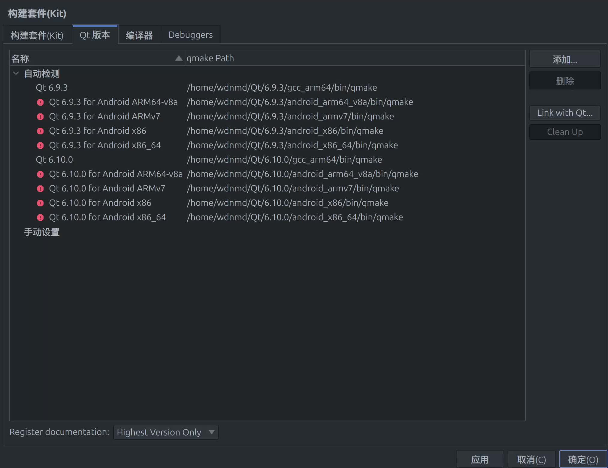
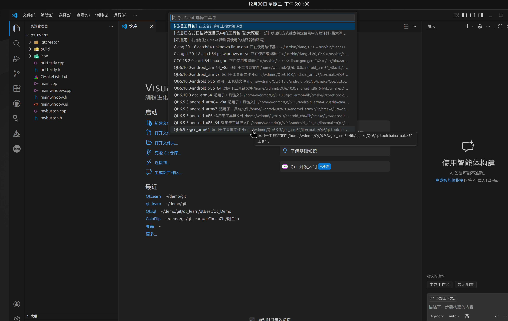

#### 记录小白学习qt的过程
> 吐槽一下Qt相关教程和实战教程真的太少了 而且质量都很一般

目录说明  
qtBest:【QT快速入门 | 最简单最简洁的QT入门教程 | 嵌入式UI】 https://www.bilibili.com/video/BV1N34y1H7x7/?share_source=copy_web&vd_source=6af53dca693e6d5496c6a5fed45a4663

qtDabing：【Qt开发编程-入门基础教程Qt5】 https://www.bilibili.com/video/BV1Jp4y167R9/?share_source=copy_web&vd_source=6af53dca693e6d5496c6a5fed45a4663

qtChuanzhi:【最新QT从入门到实战完整版|传智教育】 https://www.bilibili.com/video/BV1g4411H78N/?share_source=copy_web&vd_source=6af53dca693e6d5496c6a5fed45a4663
##### Qt连接mysql记录
###### 测试环境：mac使VMware Fusion虚拟机 ubuntu 25.10+Qt 6.9.3+mysql 8.4.7 




>1.准备工作

###### 太麻烦 不写了 下次一定

##### Qt应用打包与发布
1.下载工具
下载linux平台打包工具linuxdeployqt：https://github.com/probonopd/linuxdeployqt/releases
下载之后赋予执行全权限：

```bash
chmod +x linuxdeployqt-continuous-aarch64.AppImage
./linuxdeployqt-continuous-aarch64.AppImage
#如果提示ubuntu版本太新 需要绕过glibc检查
APPIMAGE_EXTRACT_AND_RUN=1 ./linuxdeployqt-continuous-aarch64.AppImage \
    -unsupported-allow-new-glibc \
    --version
#结果输出为以下结果，表示解包完成已可用
linuxdeployqt (commit ), build 107 built on 2025-10-21 17:58:03 UTC
#把解包得到的linuxdeployqt-continuous-aarch64.AppImage 加入环境变量方便后续使用
#确认命令可用
wdnmd@wdnmd-VMware20-1:~/桌面$ linuxdeployqt --version
linuxdeployqt  (commit ), build 107 built on 2025-10-21 17:58:03 UTC

#新建一个项目文件夹，进入需要打包的项目build/release目录，把里面的项目文件拷贝至新建的文件夹
#在新建的文件夹打开终端
#首先修改desktop.default不然会报错
sudo nano default.desktop
#修改为以下
[Desktop Entry]
Type=Application
Name=Qt_Event
Comment=My Qt Application
Exec=Qt_Event
Icon=default
Terminal=false
Categories=Utility;

#执行打包命令
APPIMAGE_EXTRACT_AND_RUN=1 linuxdeployqt Qt_Event \
    -qmake=/home/wdnmd/Qt/6.9.3/gcc_arm64/bin/qmake \  #修改为自己的qmake路径
    -unsupported-allow-new-glibc \
    -appimage

#打包完成会出现项目名.AppImage的文件 赋予执行权限后可正常运行
```
##### Vscode配置Qt开发环境(适用于Cmkae项目)
1.安装插件
不解释
2.打开qt项目cmake文件


3.配置QT代码提示
```
cd build
cmake .. -DCMAKE_EXPORT_COMPILE_COMMANDS=ON  //此步骤会在build下生成compile_commands.json
cd ../
mkdir -p .vscode
```
在vscode文件下下新建文件：c_cpp_properties.json
在里面写入：
```json
{
    "version": 4,
    "configurations": [
        {
            "name": "Qt-CMake",
            "compileCommands": "${workspaceFolder}/build/compile_commands.json",   //不要动
        //  以下手动指定可以不写
        //     "intelliSenseMode": "linux-gcc-arm64",      //编译器路径
        //     "compilerPath": "/usr/bin/c++",   
        //     "cppStandard": "c++17"
         }
    ]
}
```
刷新窗口资源：ctrl+shift+P >relaod window
QT相关头文件和宏可以正常使用


